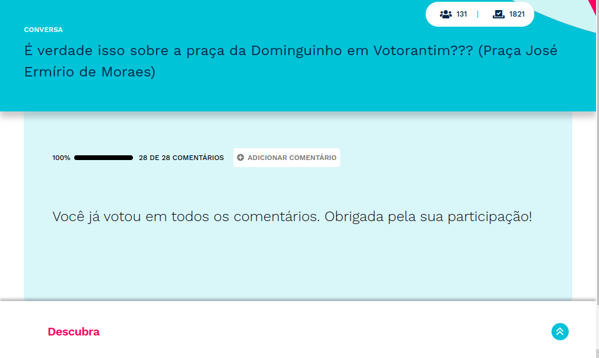
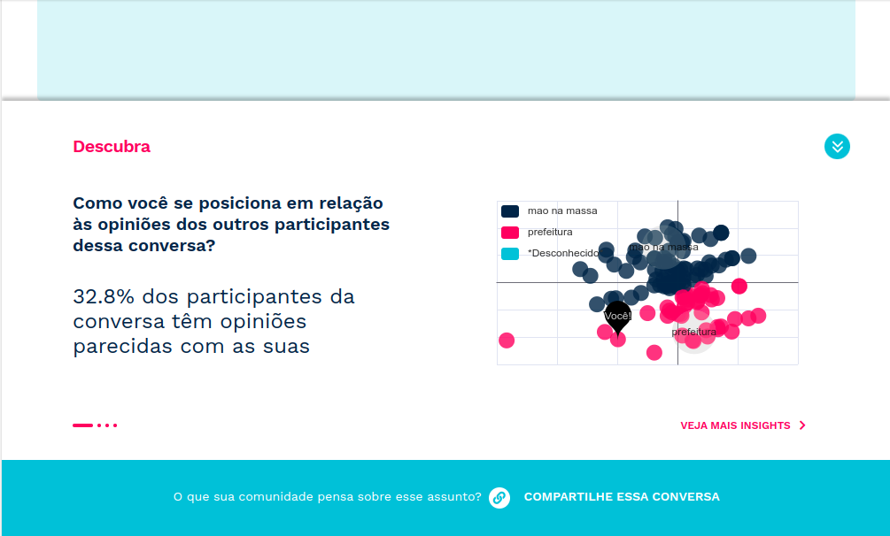
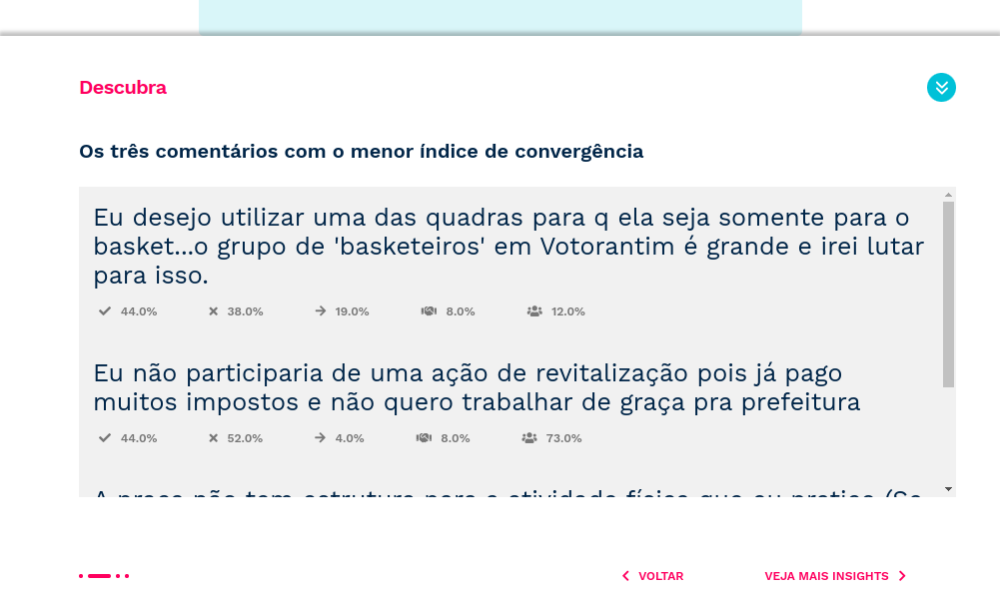

*********************************
Como participar de uma conversa?
*********************************

Para participar de uma conversa, basta acessar sua URL e a tela de participação será apresentada.
Isso pode ser feito pelo criador da conversa, clicando no botão de compartilhamento e enviado o link
para outras redes como grupos no WhatsApp e Telegram ou publicações no Facebook e Instagram.
Usuários logados também podem encontrar conversas que foram marcadas como "públicas" pelo administrador
do ambiente. Essas conversas irão aparecer na página Home, na aba "CONVERSAS PÚBLICAS".

.. note::

    Caso o criador da conversa tenha definido um período de encerramento e o acesso
    seja posterior à data final, a tela de participação não será apresentada.

Página de participação
----------------------

A página de participação é uma URL publica da EJ. Isso implica que qualquer pessoa com acesso ao link
consegue visualiza-la, mesmo que a conversa não tenha sido configurada para receber votos anônimos.

.. figure:: ../images/voting-page.png
   :align: center

   Tela de participação apresentada aos usuários comuns.

Além de votar nos comentários disponíveis, o usuário também pode enviar comentários sobre a pergunta
da conversa. Estes comentários irão para moderação, antes de ficarem disponíveis para outros participantes.

.. figure:: ../images/commenting-page.png
   :align: center

   Tela de adição de comentários apresentada aos usuários comuns.

Visualizando resultados parciais da conversa
--------------------------------------------

Na seção colapsável "Descubra", logo abaixo do comentário de uma conversa, é possível visualizar alguns dados parciais da conversa
em questão. Dados como, porcentagem de participantes que interagem de forma similar ao usuário atual,
nuvem de pontos, e apresentação dos comentários mais concordados, discordados e com menor convergência. 

foto da seção fechada

foto da seção colapsada

Compartilhando uma conversa
---------------------------

É possível compartilhar o link para a conversa clicando no texto "COMPARTILHE ESSA CONVERSA", disponível no final 
da página de participação. Nesse caso, o link será copiado para a área de transferência e poderá ser compartilhado 
com outros usuários. Os usuários poderão acessar e votar mesmo estando deslogado, caso o criador da 
conversa tenha configurado a participação anônima, nos `campos
opcionais da conversa <creating-conversation.html#campos-opcionais>`_.

.. figure:: ../images/conversation-share-btn.png
   :align: center

   Botão de compartilhamento de uma conversa

Acessando estatísticas de uma conversa
--------------------------------------

Na lateral direita do *banner*, é possível ver informações sobre a conversa que você está participando.
A primeira informação do *card* mostra o número de participantes que votaram na conversa e a segunda informação mostra 
o número total de votos que a conversa recebeu de todos os participantes.

.. figure:: ../images/conversation-statistics.png
   :align: center

   Card de dados da conversa

Além disso, é possível que o participante da coleta visualize resultados daquela conversa na seção "Descubra", na área inferior da página.

   Seção "Descubra" para visualização de resultados

   
Dados como visualização de nuvem de pontos e os comentários com menor índice de convergência, mais concordados, discordados são apresentados
se o participante votar em pelo menos quatro comentários.

   Apresentação de nuvem de pontos com posição do usuário participante

   Apresentação de comentários com menor índice de convergência

.. note::

   Somente é possível visualizar estes dados se a conversa possuir mais que três comentários.